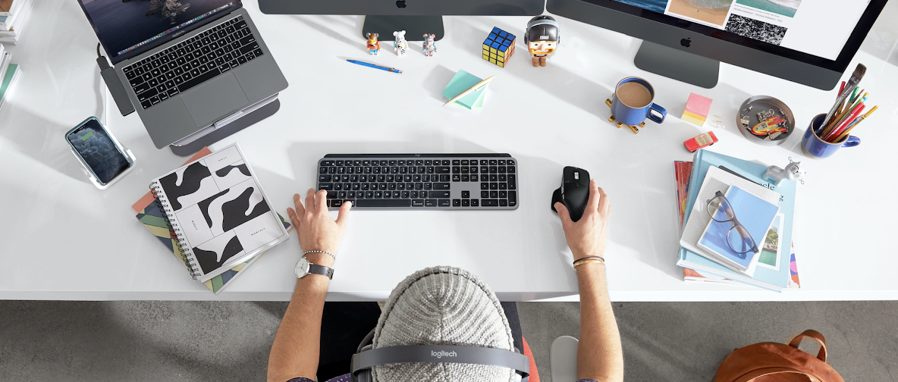

# Your mission

We want you to imagine the future of digital work. How might we help advanced creators, coders and analysts accelerate their individual and collaborative workflows? Imagine opportunities in cloud computing and services, skills transfer, 3D content creation and co-creation.

What tools, experiences and solutions can you create to streamline faster, better digital creation? Would you make the creative process more collaborative, or more distraction free? Would you create tools that translate real-world inspiration into new digital assets, or simply declutter the existing tools and assets that clog the creative’s workflow?

These are real sprints that we’re actively working through at Logitech, and we want to invite you to co-innovate with us.

This year, our familiar workspaces have been physically uprooted, and many of these problems haven’t been addressed as businesses and individuals adapt. What will you do to emotionally, mentally and digitally equip coders, animators, engineers and designers to continue innovating at the speed of thought?

Show us the future of creation.

# Food For Thoughts

The world is changing rapidly, and the future of creation is yours to determine. Let the following samples inspire your ideation.

## Real World to Digital

Source creation from the real environment - imagine ways where you can leverage your personal space to create content.

* Leverage latest Unity Technology to build scalable AR experiences with [MARS](https://docs.unity3d.com/Packages/com.unity.mars@1.0/manual/WorkingWithMARS.html#tips-for-authoring-ar-content-with-mars)
* Think about leveraging ARKit and ARCore to take real world screenshots
* If you have a brand new IpadPro why not finding an innovative way of using the LiDAR scanner? [Apple documentation](https://developer.apple.com/documentation/arkit/world_tracking/visualizing_and_interacting_with_a_reconstructed_scene)

## Enhance workflow

Each year, we increase the tools and assets we work with to get the job done. Imagine the workflow of a specific industry, and create a system or tool to improve efficacy, collaboration and organisation.
Creative industries range from 3D Modeling, Animation, video editing, to coding environments.

* Input event injections docs (Win [here](https://msdn.microsoft.com/fr-fr/library/windows/desktop/ms646304(v=vs.85).aspx) and [there](https://msdn.microsoft.com/en-us/library/windows/desktop/ms646310(v=vs.85).aspx), OSX [here](https://developer.apple.com/documentation/coregraphics/1456564-cgeventcreatekeyboardevent) and [there](https://developer.apple.com/documentation/coregraphics/1456527-cgeventpost), [Linux](https://www.kernel.org/doc/html/v4.12/input/uinput.html))
* Write an extension for your favorite code editor
* Create a plugin in a popular 3D Package like Blender - Sample code to get starte [here]()

## In The Flow

When being creative being in a state of “in the zone” is paramount. Think about how you can help manage, create and sustain distraction-free and highly productive states of mind. Your solution would also ideally help maintain a healthy work/life balance.  

* Want a quick Computer Vision sample to get you started? [This](./cv) should be a good first step towards your human activity monitoring system (no cloud involved ;-)
* Use Slack / StackOverflow APIs

## Collaborate Anywhere

COVID has physically altered our workspaces, and many of these changes will become semi-permanent as businesses adapt. What would you do to recreate the emotional impact of in person collaboration?

* xxxxxxx

## Attending HackZurich in person or have access to Logitech Hardware at home

If you’d like to use your own Logitech hardware or peripherals for these challenges, we’ll be providing SDKs for MX Master 3 and MX Keys.

* [Input Device Monitor SDK](./devmon/) : **hack into our devices!** Spy or capture device events!

* Unleash the power of the **Logitech C922 webcam**! Start with [this](https://github.com/spmallick/learnopencv) comprehensive collection of OpenCV code samples

# Rewards

Winners will get amazing prizes from our brands:

# Support

For support, ping us on [our Slack Channel](https://hackzurich2020.slack.com/archives/C018ESGLGLV)

    

